# theme-looks-pos-sells

## Installation

1. Clone the repository:

   ```bash
   git clone https://github.com/developersharifuddin/theme-looks-pos-sells.git
   ```

   Navigate into the project directory:

   ```
   cd theme-looks-pos-sells
   ```

2. Install dependencies:

   ```
   composer install
   ```

   Copy the .env.example file to .env and configure your environment variables, including the database connection.

3. Generate application key:

   ```
   php artisan key:generate
   ```

4. Migrate the database:

   ```
   php artisan migrate
   ```

5. Seed the database:

   ```
   php artisan db:seed
   ```

Then a admin and some roduct seeding into users and items tables.

Usage
To access the application, navigate to http://localhost:8000 in your browser.

```
http://localhost:8000/login
```

# Admin Login:

email: admin@gmail.com
password: 12345678

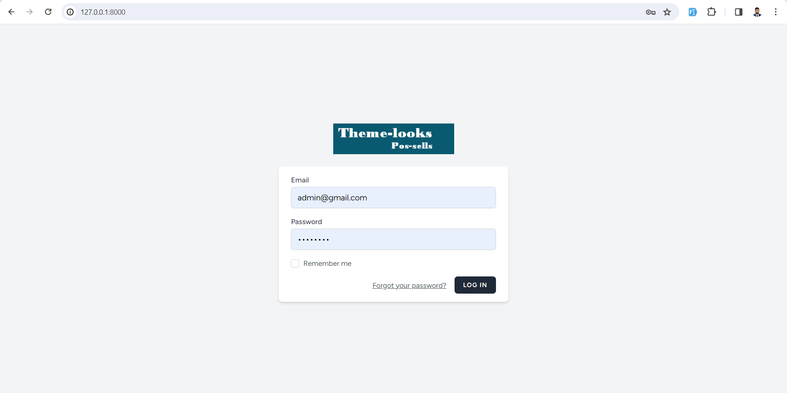

# After login in, Redirect to admin dashboard.

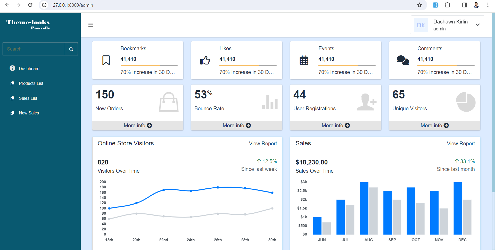

# Go to product List

http://127.0.0.1:8000/admin/products

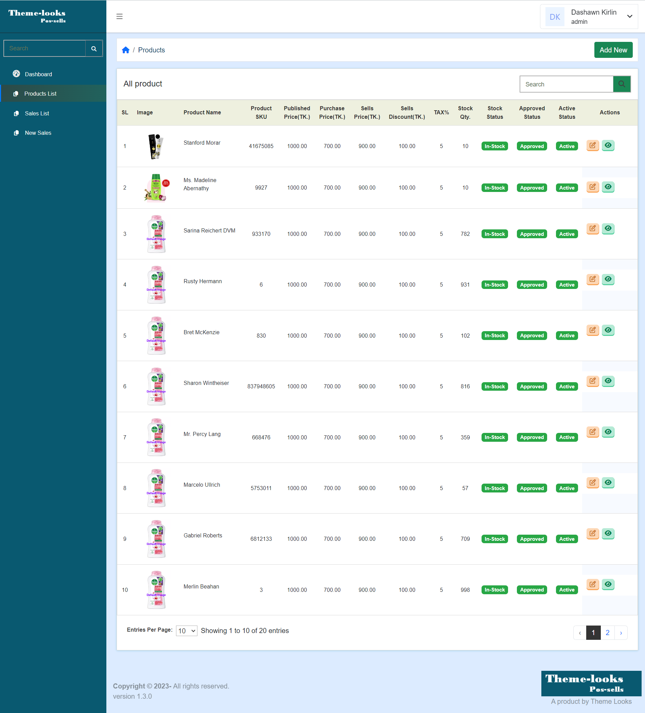

# Create a new product

http://127.0.0.1:8000/admin/products/create

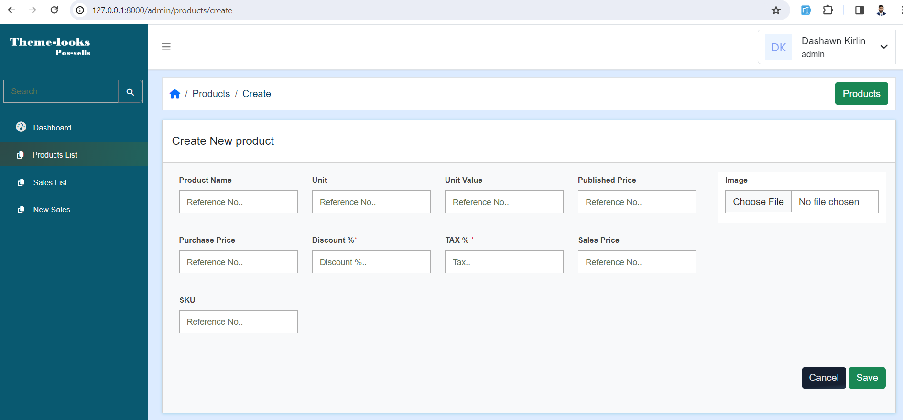

# Edit product

http://127.0.0.1:8000/admin/products/20/edit

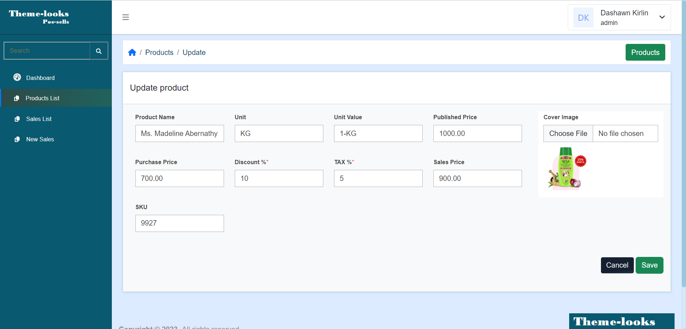

# View product

http://127.0.0.1:8000/admin/products/20

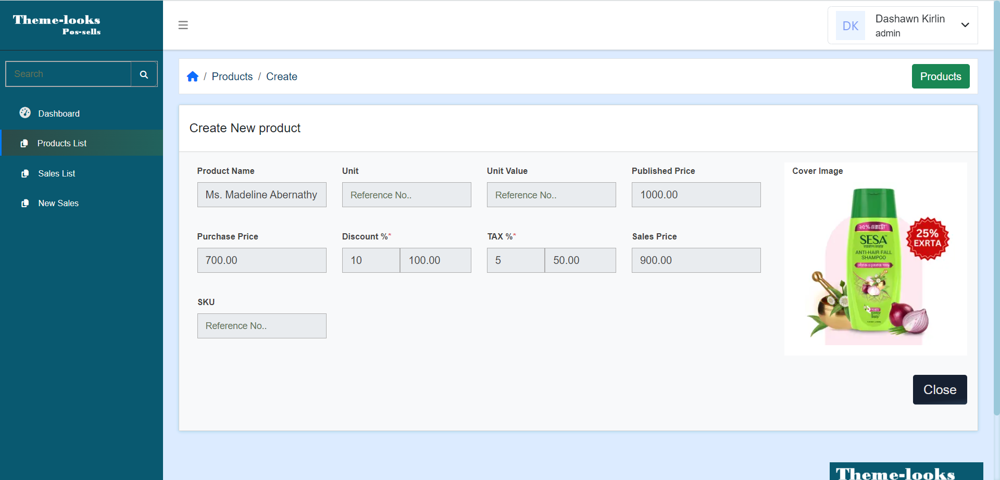

## Sells

# Go to Sells List: http://127.0.0.1:8000/admin/sales

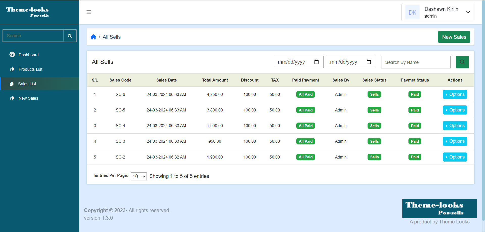

# Click On "New Sales"

Add to cart or search product by name or SKU code and add to cart. then save Sells/order and saved data into database and redirect to Sells List page.

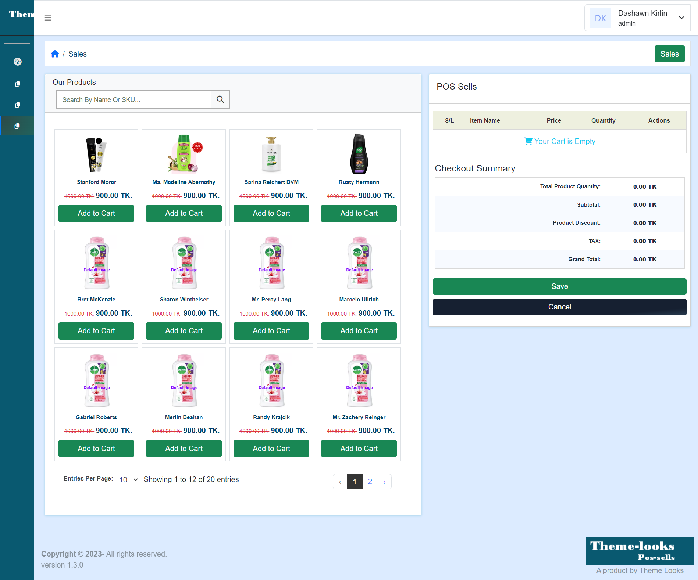

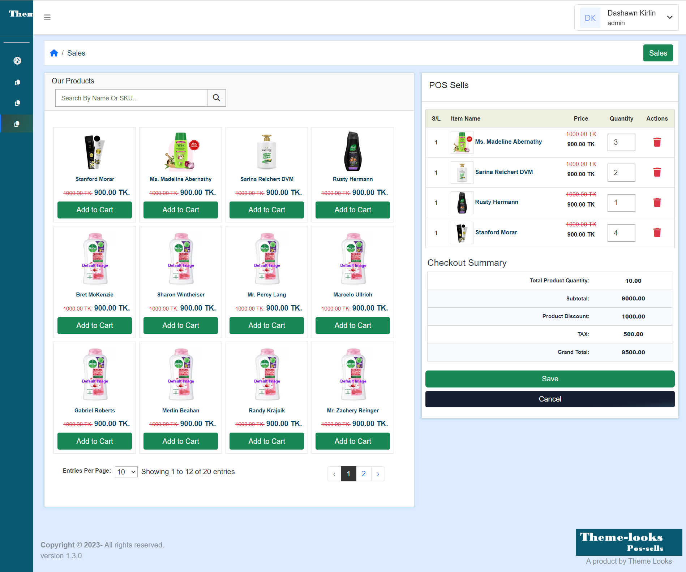

# Then click on option button and view sell details.

http://127.0.0.1:8000/admin/sales

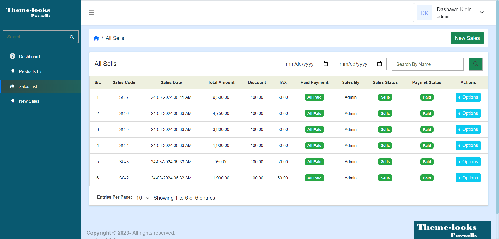
http://127.0.0.1:8000/admin/sales/6

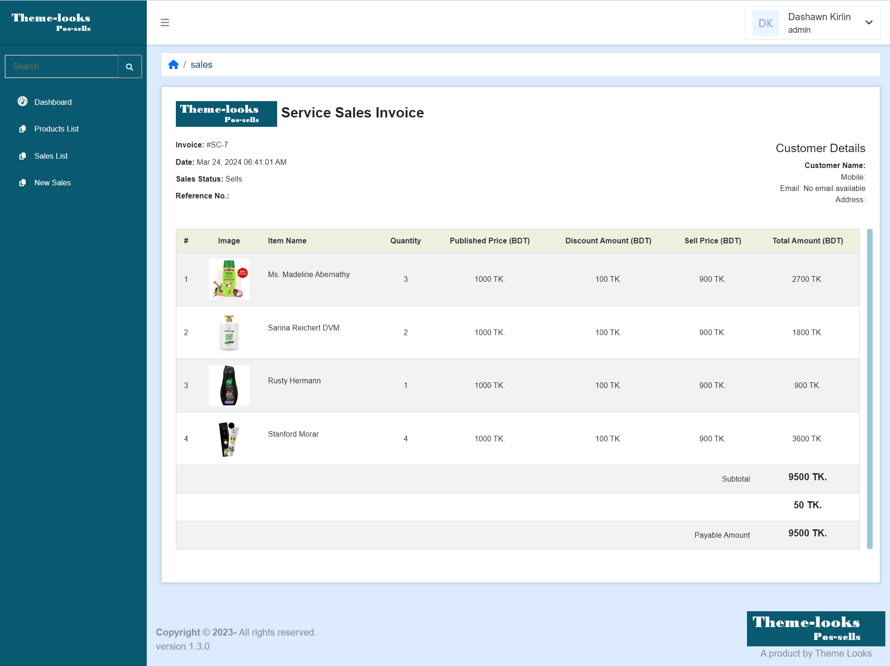

Thank you for your time considerations.
License
This project is licensed under the MIT License.
